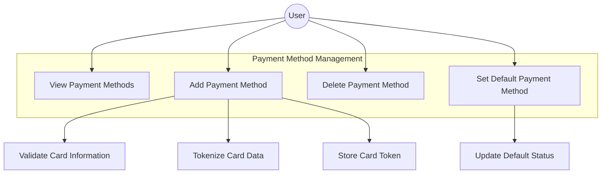
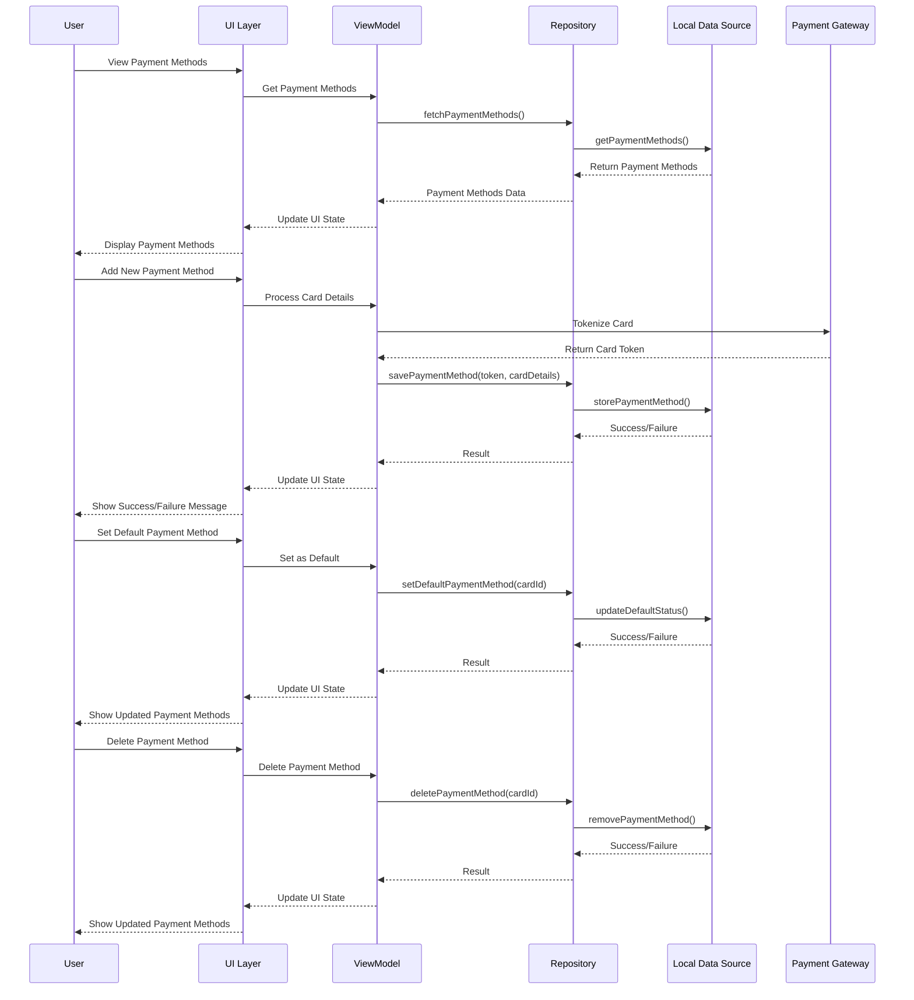
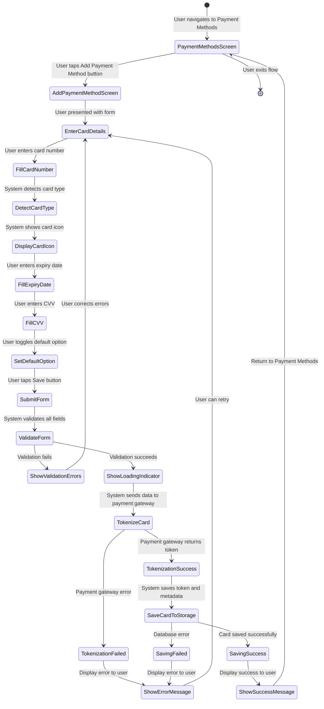

# Software Requirements Specification (SRS) for Payment Method Configuration Feature

## History of documents

| Version | Content | Author | Reviewed by |
| :---- | :---- | :---- | :---- |
| **1.0** | Initialize the SRS document | Dawn Nguyen | April 15, 2025 |

## 1. Overview of Payment Method Configuration Feature

**As a user, I want to add, manage, and select payment methods so that I can securely pay for my orders without re-entering payment information for each purchase.**

## 2. Diagrams

### 2.1 Use Case Diagram



### 2.2 Sequence Diagram



### 2.3 Add Payment Method Flow Diagram



## 3. Use Case Specification

| Use Case ID | UC-PM-001 |
| :---- | :---- |
| **Use Case Name** | Add and Manage Payment Methods |
| **Description** | As a user, I want to add, manage, and select payment methods so that I can securely pay for my orders without re-entering payment information for each purchase. |
| **Actors** | App User |
| **Pre-Conditions** | 1. User is logged in to the app<br>2. User has access to the account settings |
| **Post-Conditions** | 1. Payment method is successfully saved, updated, or deleted<br>2. User can use the payment method for purchases |
| **Basic Flow** | 1. User navigates to the Payment Methods screen<br>2. User views existing payment methods (if any)<br>3. User taps on "Add Payment Method" button<br>4. User enters card details (number, expiration date, CVV)<br>5. User optionally marks the card as default<br>6. User submits the form<br>7. System validates the card information<br>8. System securely tokenizes the card<br>9. System saves the token and relevant card information<br>10. System returns to Payment Methods screen with updated list |
| **Alternative Flows** | **AF1: Invalid Card Information**<br>1. At step 7, if card information is invalid<br>2. System shows validation errors on the form<br>3. User corrects the information<br>4. Flow continues from step 7<br><br>**AF2: Delete Payment Method**<br>1. From Payment Methods screen, user selects delete option on a card<br>2. System confirms deletion request<br>3. System deletes the card information<br>4. System refreshes the Payment Methods list<br><br>**AF3: Set Default Payment Method**<br>1. From Payment Methods screen, user selects "Set as Default" option<br>2. System updates the default status<br>3. System refreshes the Payment Methods list |

## 4. Non-Functional Requirements

1. **Security**
   - Card numbers must be securely tokenized before storage
   - Only first 6 and last 4 digits of card numbers should be stored
   - CVV should never be stored
   - All card data transmission must be encrypted

2. **Performance**
   - Payment method operations should complete within 3 seconds
   - Screen transitions should be smooth and under 300ms

3. **Usability**
   - Form should provide real-time validation feedback
   - Card type should be automatically detected and displayed
   - Error messages should be clear and actionable

4. **Compliance**
   - Implementation must comply with PCI DSS requirements
   - Privacy policy must be updated to include payment data handling

## 5. Mockup UI

### 5.1 Payment Methods List Screen

```
PaymentMethodScreen
```

### 5.2 Add Payment Method Screen

```
PaymentConfigScreen
```

## 6. Detailed Description of Items on Screen

### 6.1 Payment Method List Screen

| No | Component | Type | Required | Editable | Min Length | Max Length | Default Value | Description |
| --- | --- | --- | --- | --- | --- | --- | --- | --- |
| 1 | Toolbar | Component | Yes | - | - | - | - | App bar with back button and screen title "Payment Methods" |
| 2 | Payment Methods List | List | Yes | - | - | - | - | List of saved payment methods with card info and options |
| 3 | Card Item | Component | - | - | - | - | - | Card showing payment method details |
| 4 | Card Type Icon | Image | - | - | - | - | - | Visual indicator of card type (Visa, Mastercard, etc.) |
| 5 | Card Number | Text | - | - | - | - | - | Masked card number (e.g., •••• 1234) |
| 6 | Default Indicator | Label | - | - | - | - | - | Label showing if card is set as default payment method |
| 7 | Delete Button | Button | - | - | - | - | - | Button to remove the payment method |
| 8 | Set Default Option | Checkbox | - | Yes | - | - | - | Option to set card as default payment method |
| 9 | Empty State Message | Text | - | - | - | - | - | Message displayed when no payment methods exist |
| 10 | Add Method Button (FAB) | Button | Yes | - | - | - | - | Floating action button to add a new payment method |

### 6.2 Add Payment Method Screen

| No | Component | Type | Required | Editable | Min Length | Max Length | Default Value | Description |
| --- | --- | --- | --- | --- | --- | --- | --- | --- |
| 1 | Toolbar | Component | Yes | - | - | - | - | App bar with back button and screen title "Add Payment Method" |
| 2 | Screen Title | Text | Yes | - | - | - | "Card Information" | Title for the card form section |
| 3 | Card Number Field | TextField | Yes | Yes | 13 | 19 | - | Input field for card number with auto-formatting |
| 4 | Card Icon | Image | Yes | - | - | - | Generic card | Icon that updates based on detected card type |
| 5 | Expiration Date Field | TextField | Yes | Yes | 4 | 4 | - | Input field for card expiration date (MM/YY format) |
| 6 | CVV Field | TextField | Yes | Yes | 3 | 4 | - | Input field for card security code (3-4 digits) |
| 7 | Default Card Checkbox | Checkbox | Yes | Yes | - | - | False | Option to set this card as the default payment method |
| 8 | Save Button | Button | Yes | - | - | - | - | Button to submit and save the payment method |
| 9 | Error Messages | Text | - | - | - | - | - | Validation error messages for each field |
| 10 | Loading Indicator | ProgressBar | - | - | - | - | - | Indicator shown during tokenization and saving |